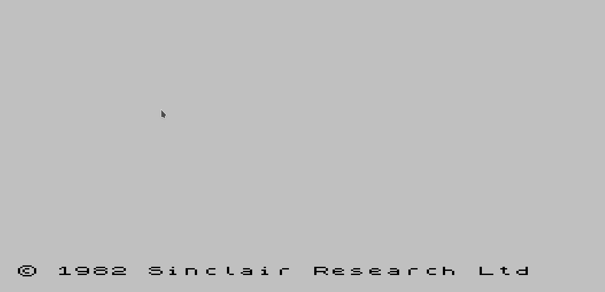

# .SCL2TRD dot command for esxDos

## What is it?

This is tool for converting your SCL files to TRD on your real speccy with esxDOS(divMMC/divIDE hardware, ZX-Uno, ZX Spectrum next etc) made as dot-command.

This tool can make cutted TRD(may be used only for read-only, but smaller size) and full TRD files.  

## How to use it?

If you want make cutted trd just call `.scl2trd <filename>.scl` and it converts your file to cutted TRD.

If you want make full trd(write enabled) - `.scl2trd f <filename.scl>` and it converts your file to full TRD.

There also [version with buildin shell](https://github.com/nihirash/esxdos-scl2trd).

## Where get already built version?

If you want just download ready to use version of tool, please download latest version from [releases page](https://github.com/nihirash/esxdos-scl2trd-dot/releases)

## If you want contribute?

Please, fork repo, make your changes and make PR.

Any kind of PRs are welcome - misspell fix, code improvement, usability extendions, documentation etc.

If it possible - please send all your improvments to me as PR. I'll be very glad!

## If you want support me?

You may donate me via [PayPal](https://www.paypal.me/pinport).  

## Legals

Copyright (C) 2019 Alexander Sharikhin aka Nihirash(anihirash@gmail.com)